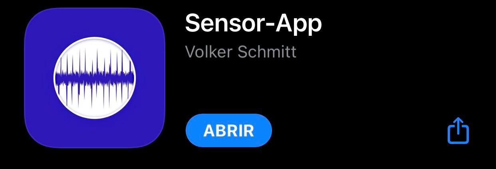
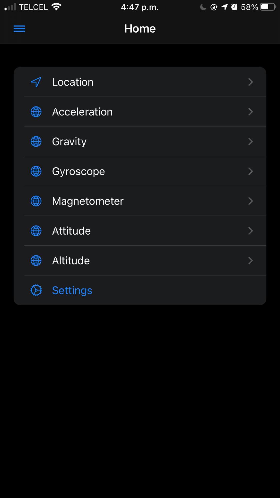

**Sesion 10-MARZO-2021**

# **¿Qué sensores tiene su smarphone via APP?**

La aplicación a utilizar en mi Iphone fue la siguiente:

La cual cuenta con los sensores siguientes:

***1. Location:***

Mide la locación en las que se ubica el dispositivo actualmente.

***2. Acceleration:***

Mide la aceleración.

***3. Gravity:***

Mide la gravedad en la que se encuentra.

***4. Gyroscope:***

Mide el movimiento rotacional.

***5. Magnetometer:***

Mide la fuerza y dirección del campo.

***6. Attitude:***

Comportamiento del dispositivo.

***7. Altitude:***

Mide la altitud.

[***Ir a mi repositorio de Github.***](https://github.com/DianaHFer/Sistemas-Programables)